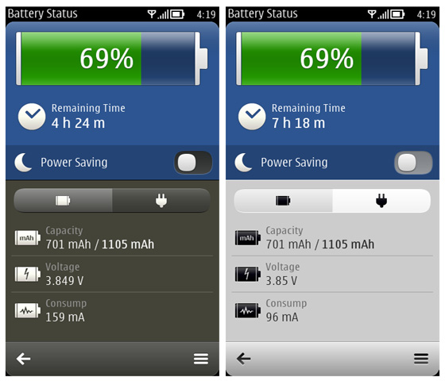
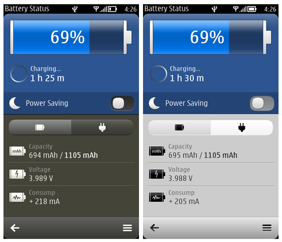
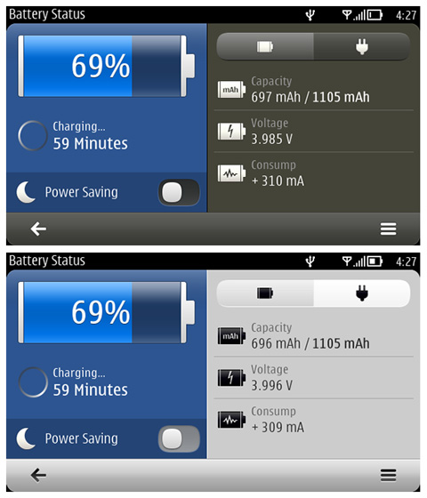
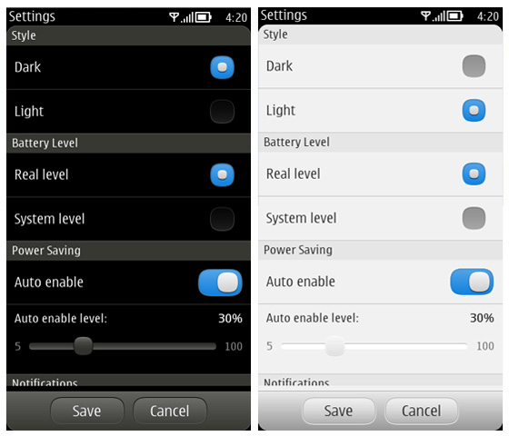
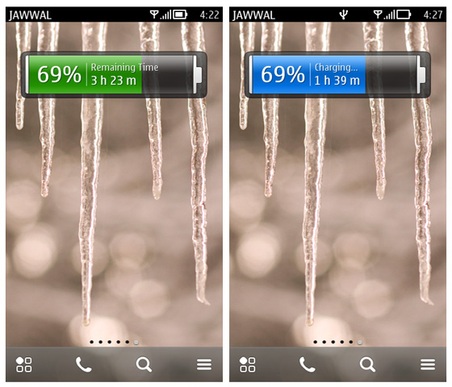

# Battery Status

Battery Status & Information for Symbian, written using Qt QML and Qt Quick Libraries.
* [Battery Status in symbian-developers.net](http://forum.symbian-developers.net/symbian3-applications/%28free%29-battery-status-v1-1-0-by-motaz-alnuweiri/)

##### ScreenShot:







##### New in v1.1.0:
 - New UI
 - Fix Homescreen widget glitch
 - Some improvements

##### New in v1.0.1:
 - Lots of improvements
 - Fixed Homescreen widget bugs
 - Added option to control notify sound level
 - Added option to reset Application data to fix any problems
 - Added option to control Homescreen widget background opacity

##### New in v1.0.0:
 - New UI and Icons
 - Fix all lag problems
 - New clean widget
 - Support landscape & E6
 - New info tabs (Battery & Charger)
 - Add last used charger type info
 - Add last charged time with level info
 - Add currect charging time info when charging
 - Add Notification Sounds (Full Charged, Battery Low & Very Low)
 - Auto enable "Power Saving"
 - Some improvements

##### Important:
The application conflict with this applications:
 - Nokia Battery Monitor
 - Nokia Energy Profiler

> **Note:**
> When you tap the back button or red key or close it from task manager the program not exit it hide in the background to keep update the widget (If you need to close the program tap menu and select "Exit")

## Build
To build the app you need:

```sh
Qt 4.7.4 for Symbian Belle (Qt SDK)
```

**Copyright (C) 2014 for [Motaz Alnuweiri](https://github.com/Motaz-Alnuweiri), All rights reserved.**
